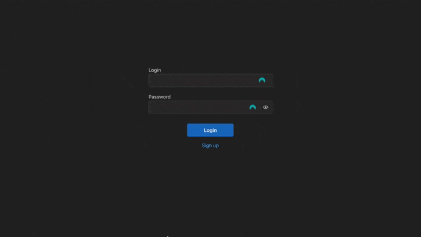

# Project on the profession «Fullstack developer»

## ☁️ Cloud-based storage

A web application that acts as cloud storage. The application allows users to display, upload, send, download, and rename files. Users can register, log in to an account, and log out of an account. The user has access only to their account and their files. There is an administrative interface - the administrator can perform all the above actions with any users or files.



## 🛠 Tech stack

Python v.3.10+, NodeJS v.18+, PostgreSQL v.14+.
Django, React, Redux, etc.

## 🔮 Local running

The easy way. Install [docker](https://docs.docker.com/get-docker/) and then:
```
$ git clone https://github.com/lulzseq/netology-cloud-storage.git
$ cd netology-cloud-storage
```
Add your PostgreSQL user data to `docker-compose.yml`, and also you can add `REACT_APP_API_URL` as `127.0.0.1:8000` and build app:
```
$ docker compose up --build
```
On the first run you might need to wait until the all migrations will be done. After that you can open app on localhost:3000.

## 👮‍♀️ License
[MIT](https://github.com/lulzseq/netology-cloud-storage/blob/master/LICENSE)
